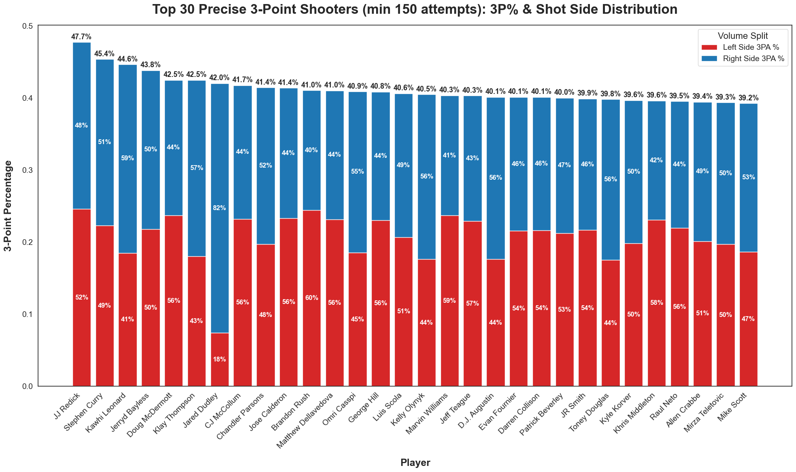
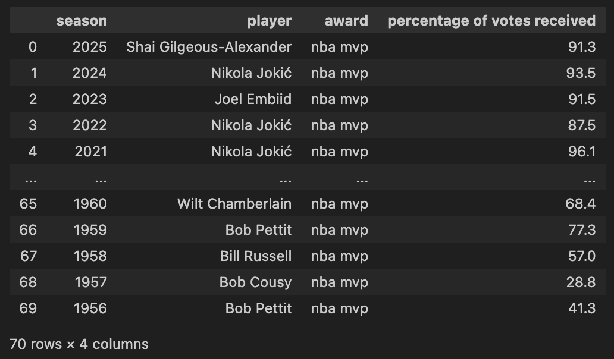
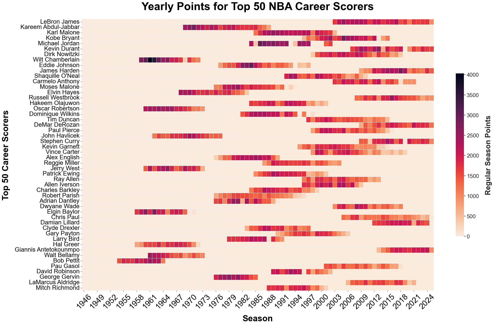
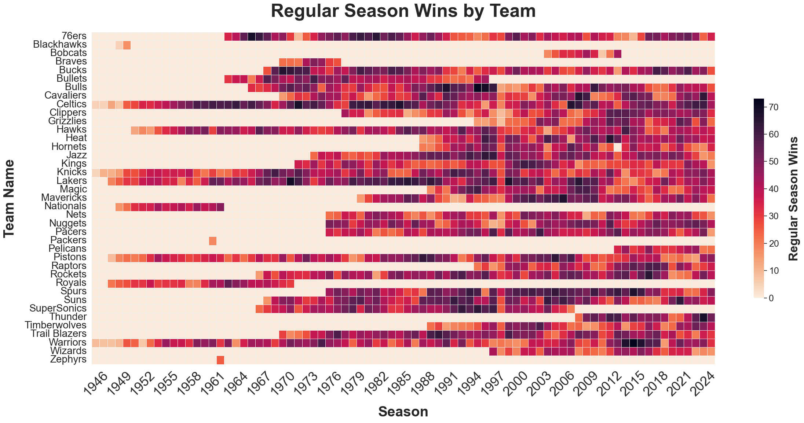
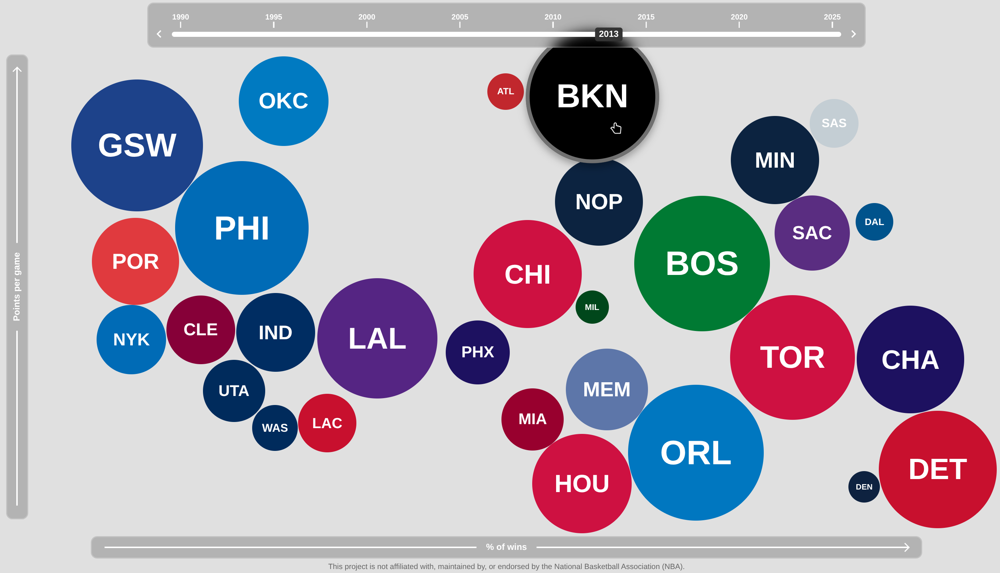

# HoopViz - Milestone 1

Deadline: Friday, 20th march, 2026

## 1 - Dataset

To build our visualization, we need **rich data** on both **NBA players and teams**.
This includes per-game statistics, detailed shot and play information (locations, event types, lineups), players awards & attributes, team performance by season, franchise history, and schedules.

Fortunately, NBA data is widely available and well structured, and we plan to rely on the following **three main datasets**: 

- A community-maintained NBA dataset that aggregates most core information about teams and players (box scores, basic play-by-play, statistics and contextual game data): <https://www.kaggle.com/datasets/eoinamoore/historical-nba-data-and-player-box-scores>
- A complementary play-by-play dataset with detailed shot information, including on-court coordinates, which we will use to enrich the first source: <https://www.kaggle.com/datasets/brains14482/nba-playbyplay-and-shotdetails-data-19962021/data>
- An additional dataset for the awards (MVP, NBA All-Team, ...) that are distributed at the end of each season: <https://www.kaggle.com/datasets/sumitrodatta/nba-aba-baa-stats>

Then we might use other tools to gather metadata or interesting displayable information like:

- To get the headshot picture of the NBA players (should attribute source <https://nba.com>): [nba-headshot-downloader](https://github.com/GreenGuitar0/nba-players)
- Social Power of player (salary, twitter engagement, wikipedia traffic for 2016-2017): <https://www.kaggle.com/datasets/noahgift/social-power-nba>
- Official stats website: <https://www.nba.com/stats> - For any missing information we might want to use at a later stage in the project, we have almost all the data available on this website, we can use a small python script to convert the HTML documents in CSV, but we think we'll probably already have everything we need with the previous three main datasets.

Our focus will really be on the three main datasets above, and we'll use additional data depending on our available time and advancement in the project.

The data in those datasets is already of **high quality** and **won't require heavy data processing**.
For the actual end product website we're going to produce, we might just need to do some **data aggregation** and **shaping** from the multiple datasets but nothing major.
Our data pre-processing pipeline will be done in **Python** with a **clear and reproducible system** from the actual datasets will be **explained on the repository** along with our generation scripts.

## 2 - Problematic

Statistics are at the heart of basketball culture, and the NBA especially prides itself on a **rich history of analytics** that allow fans to compare players across generations.
Since the NBA produces so much data, since 1946, and over its 80 seasons, it could be not only helpful but also beautiful to display all of the **historical trends** and player metrics compiled and organized in one website, showing the story behind such an important sport.

Through a series of visualizations, each telling a specific story, the aim of this project is to show the evolution of players and teams along with revealing specific insights and maybe find hidden gems deep inside the data.

We will try to answer interesting questions in a **new and dynamic** way.
Here are a few examples of questions a user would find by navigating through the user experience:

- Which players were the most efficient scorers of any given season?
- What is the play style of any given player (based on position on the court, throws and movements)?
- How closely do team statistics (like assists or rebounds) correlate with winning a championship?
- How has the volume of three-point shooting changed the spatial layout of the game?
- What play styles are currently the most dominant through the years? and were they proven to lead to more wins?

This project is aimed at anyone who has any **interest in basketball and sports analytics**.
It is interesting to be able to compare legendary players to each other, and see by what percentage the pace of play has increased, or if there is a stark "Three-Point Revolution" that can be observed on the court.
As our **focus will be on interactivity**, we aim to display information in a **playful** way and integrate visualization as part of data filtering in **creative fashion** ;)
Even for people who aren't analytics nerds, it will be fun to know how the game has evolved, and seeing historical shot maps may motivate some to appreciate the incredible skill of past and present superstars!

## 3 - Exploratory Data Analysis

We already explored our three main datasets to get a sense of their structure, coverage, and quality.
Here's what we found.

**Note**: You can check our full [data exploration notebook](../scripts/data_exploration/exploration.ipynb), but we also reported the main results below for your convenience.

- **Player statistics**: The dataset contains over 1.6 million rows, covering games from November 1946 all the way to the current 2025-26 season. Each row represents a single player's performance in a single game, with 35 columns including points, assists, rebounds, shooting percentages, and +/- impact. As a quick sanity check, looking at the 2015-16 season, Stephen Curry tops the scoring chart at 30.1 PPG, followed by James Harden and Kevin Durant — which matches historical records perfectly.

- **Team statistics**: Around 145'000 rows, also starting from 1946, with 48 columns per game entry. This includes all the usual box score stats plus richer game level data like fast break points, paint points, biggest lead, and lead changes. The 2015-16 Warriors season stands out immediately with 73 wins, the all-time regular season record.

- **Shot Details**: This dataset only starts from the 1996 season (when the NBA began tracking spatial shot data), but it's by far the richest one in terms of granularity. For the 2015-16 season alone there are ~208'000 shot attempts, each with court coordinates (`LOC_X`, `LOC_Y`), shot zone, distance, and whether it went in. Shot locations are centered on the basket, with x coordinates ranging from -250 to 250 (in tenths of a foot) and y from slightly negative (behind the backboard) up to the half-court line.

- **Awards**: The awards dataset has 3'465 entries across MVP, Defensive Player of the Year, Rookie of the Year, and more, going back to the 1956 season. It also includes vote share, so we can see not just who won but how dominant the win was (e.g. Nikola Jokić's 2021 MVP at 96.1% of votes). The All-Star selections go back to 1951 with 2'058 entries, and the End of Season Teams (All-NBA, All-Defensive, All-Rookie) cover 2'222 entries since 1947.

- **Key plots**: The heatmaps below illustrate the coverage and density of the data nicely. The player heatmap shows career scoring totals by season for the top 50 all-time scorers, with Wilt Chamberlain peaking at 4'029 points in a single season, a staggering number. The team heatmap shows win totals by franchise across every season, making historical dominant runs (the 80s Celtics/Lakers, the 90s Bulls, the mid-2010s Warriors) immediately visible.

Overall, the **data is in great shape** with very **high quality**.
There are some minor typing differences we need to be aware of, but nothing that requires heavy cleaning.
The main work will be in joining and aggregating across the three datasets: for instance, linking shot coordinates to player profiles, or matching award history to per-season statistics.

## 4 - Related work

### 4.1 - Previous work

We thoroughly researched and reviewed several existing NBA visualization projects, including public dashboards and previous COM-480 projects, such as:

- NBA official stats website - <https://www.nba.com/stats>
- NBA team dashboard - <https://nbavisuals.com/team-dashboard>
- NBA players card system - <https://databallr.com/dashboard>
- NBA shot charts per player - <https://public.tableau.com/app/profile/daniel.teo/viz/NBAShotCharts_15795208182820/ShotChart>
- Scoring radial - <https://public.tableau.com/app/profile/jeff.plattner4532/viz/KobePrint/Kobescoringradial>
- Quadratic analysis grid - <https://transformingbball.com/volume-efficiency/>
- NBA player profile rebound - <https://dribbble.com/shots/15570031-NBA-Player-Profile-Rebound>
- NBA player network visualization - <https://svitkin.shinyapps.io/bball-trade-network/>

COM-480 past projects:

- <https://github.com/com-480-data-visualization/com-480-project-freespin>
- <https://github.com/com-480-data-visualization/datavis-project-2022-lebron-jenkins>
- <https://github.com/com-480-data-visualization/datavis-project-2022-run>

### 4.2 - Why our approach is original

While these works provide **valuable inspiration** and demonstrate a wide range of visualization techniques, they also reveal some common **limitations**.
Most notably, we found the focus on traditional data displays was really **focused on statistics** and a lot less on actual usability and user experience.
That leads to websites full of intricate, though interesting, tables.
They often contain **raw or color coded numbers and actual data points**.
So although there are some ideas to show the data in a digest and fun way (see related work section above), on most sites it feels like you're staring at a tax return instead of a basketball game.
Users may struggle to identify the most relevant insights or to navigate efficiently between different perspectives.
Another key limitation of most of the existing solutions is the **selecting/filtering systems** they use: most websites make you **preselect** a year/player/team combo in some kind of dropdown menu before showing you any data.
While this is fine for specific information about a given situation, it tends to make the **interpretation of the global aspect and movement of the data** hard to grasp.

These observations motivated us to explore a different direction.
We want to rethink how users interact with the data and how information is presented, focusing on the **user experience** part of the website and actual **dynamic and interactive visualizations**.
This is especially true for our **selection system** where we want to bring a creative approach to avoid forcing the user to preselect specific parts of interest beforehand, but instead directly show **time-aware visualizations** of the global picture, right on the landing page!
We really want to leverage **intuitive design patterns** and **fluid animations** that reveal insights at a glance, allowing the data to mirror the fast-paced energy of the game itself along with revealing every drastic changes there have been over the years.

### 4.3 - Source of inspiration

Our main visual and interactive inspirations come from a mix of basketball specific and completely unrelated sources.

On the NBA side:

- Kirk Goldsberry's work on twitter <https://x.com/kirkgoldsberry> is a gold standard for us. His shot charts and court-based visuals manage to tell a **compelling story with minimal clutter**, and we want to capture that same clarity.
- The NBA 2K game UI <https://nba.2k.com/> also inspired us a lot in terms of **energy and responsiveness**. It feels alive and fun, and that's the vibe we're going for.
- Court shot heatmap <https://toddwschneider.com/posts/ballr-interactive-nba-shot-charts-with-r-and-shiny/> is another great reference, showing how **shot location data** can be turned into something genuinely beautiful and explorable. 

Beyond basketball, some of our strongest design inspirations come from **totally different domains**:

- Coin360 <https://coin360.com/> uses a **treemap** of dynamic rectangles to represent financial markets, and it instantly gives you a global picture before you dive into specifics: exactly the kind of **"selection in visualization" philosophy** we want to bring to our project.
- The Agar.io game <https://agar.io/> might seem like an odd reference, but its **fluid bubble physics** and the way entities of different sizes coexist in a shared space is a surprisingly good mental model for how we want teams or players to feel on our platform..
- Finally, <https://earth.nullschool.net/> blew us away with how it turns dense and complex raw atmospheric data into something meditative and almost poetic, proof that even **very large and unintuitive datasets can feel immersive and fun** to explore if the interaction is done right.

## 5 Extra work

We already jumped ahead and started programming a **small prototype** (or proof of concept) of our "selection in visualization" system using **bubbles**.

<https://com-480-data-visualization.github.io/HoopViz/>

The idea is to use a **2D positioning grid** on which you can zoom and pan around, that way every bubble already contains **three valuable insights**: the x position, the y position, it's size.
Each insight can later be mapped to a specific statistic, like bubble size could be the number of team wins, the x position could be the number of points, and the y position could be the percentage of ball possession in a game.
Then the user can **explore the data right away** and later click on any bubble to reveal that team's specific statistics (not yet implemented).
An interesting idea is to give the user the **choice among a few pre-defined statistics** (like point scored, number of wins, shot percentage, percentage of 3 points, ...) for all the three bubble parameters, so that they can create a **unique visualization** that tailors to their curiosity and area of interests.
We could also **randomize the default ones** on page load, such that every time the user visits the website they are presented with a brand new view on the data that they might never have seen before!

The most interesting part here begins when you start noticing the **time traveling slider** at the top of the website.
You can use it to change the year and see with **transitions** how the data/bubbles evolve over time!
You can also use your keyboard’s arrow keys (or arrow buttons on the slider) to change year by year, or jump multiple years by directly clicking anywhere on the slider.
At this point, all the data on the prototype is just randomly generated but the setup to get it dynamically from actual files later is already in the JavaScript.

Later we would like to have a way for the user to actually **customize** the x and y axis and the size of the bubbles to other parameters.
The goal here is really to come up with a **dynamic**, **playful** and **interactive** way to visualize the data without displaying difficult tables or preselecting which data we want to see :)

At this point, the prototype website was built without any external tool or library, it's plain vanilla HTML CSS and JS.
We plan to use D3js later to display interactive charts.

We also put a nice **devops effort** by setting up the GitHub repository properly, with a README, a deliverables directory for ease of access to Milestones, a protected main branch, an automatic CI job to deploy the static website to GitHub pages, and a system for mandatory peer review of every pull requests (that way all the members of the group stay on track with what is going on).

We can't wait to move forward with the project and see what it will become, and how it will reveal interesting insights about the NBA!
